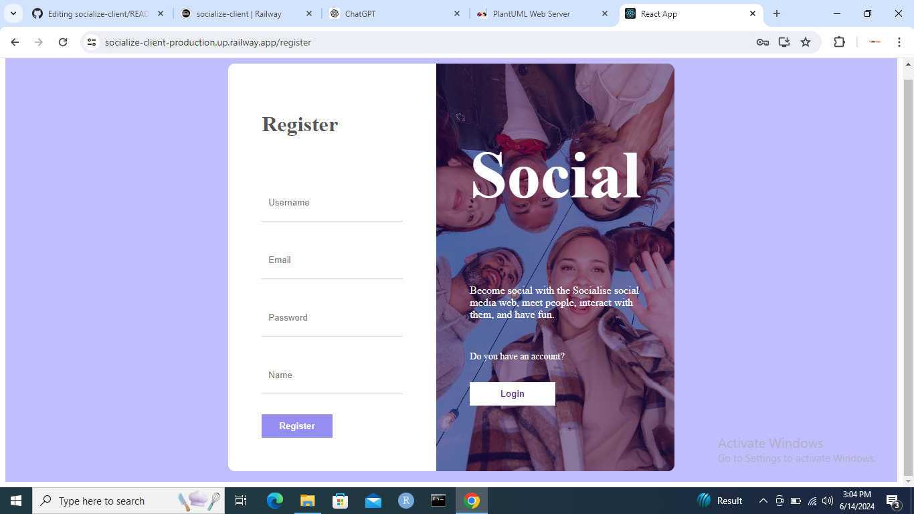
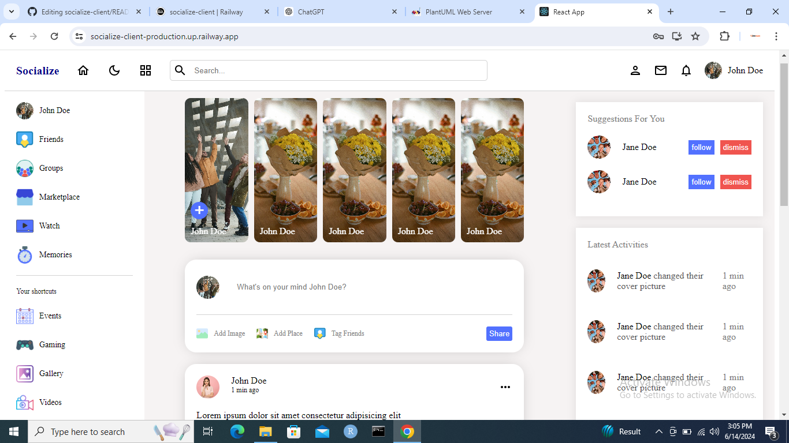

# Create React App

## ✨ Features

- **Authentication and authorization**
  
- **Interactive feed**
  
- Ability top post
- **Commenting**
  
- 
## 💁‍♀️ How to use

- Creat an account with a valid school email, password, unique username, and your name
- Go to login and wnter your username and password and click the login button
- now browse through your customize user feed and see what your peers are upto

## ❓ Why use Socialize
If you want a more secluded community about your school friends and what dey do, study, and projects they are on then Socilaize is for you

**Link:**

- [Website]([https://caddyserver.com/docs/caddyfile](https://socialize-client-production.up.railway.app/))
